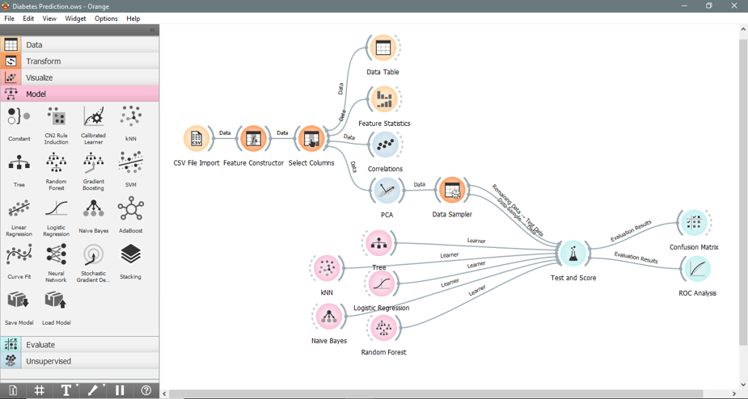

# Data Mining Project - Orange Tool

# Business Reason

Diabetes is a prevalent chronic disease affecting over 130 million adults in the U.S., leading to severe complications and a significant economic burden. Predictive models for diabetes risk can aid in early diagnosis and effective management, making them crucial for public health.

# Data Source

- Dataset: [Diabetes Health Indicators Dataset](https://www.kaggle.com/datasets/alexteboul/diabetes-health-indicators-dataset)
- Source: Kaggle
- Description: The dataset contains 253,680 survey responses from the BRFSS 2015. It includes various health indicators and a target variable (Diabetes_binary) indicating diabetes status (0 for no diabetes, 1 for prediabetes or diabetes).

# Data Processing

1. Data Import

- CSV File Import Widget: Loaded diabetes_binary_health_indicators_BRFSS2015.csv.
- ID Attribute Creation: Added ID attribute to dataset.
- Select Columns Widget: Set Diabetes_binary as the target attribute and ID as meta.

2. Data Exploration

- Feature Statistics Widget: Checked for missing values and data distribution.
- Correlation Analysis: Identified highly correlated attributes such as (Education; Income) and (GenHlth; PhysHlth).

3. Dimensionality Reduction:

- PCA Widget: Reduced dimensions by keeping the top 18 attributes that explain over 95% of the variance.

4. Data Sampling:

- Data Sampler Widget: Addressed data imbalance and prepared data for model training.

5. Modeling:

- Algorithms Used: Decision Tree, Random Forest, Naïve Bayes, Logistic Regression, kNN.
- Cross-validation: Applied 20-fold cross-validation within the “Test and Score” widget.

# Evaluation

Best Model: Logistic Regression, with a classification accuracy of 86.4% and an AUC of 0.822.
