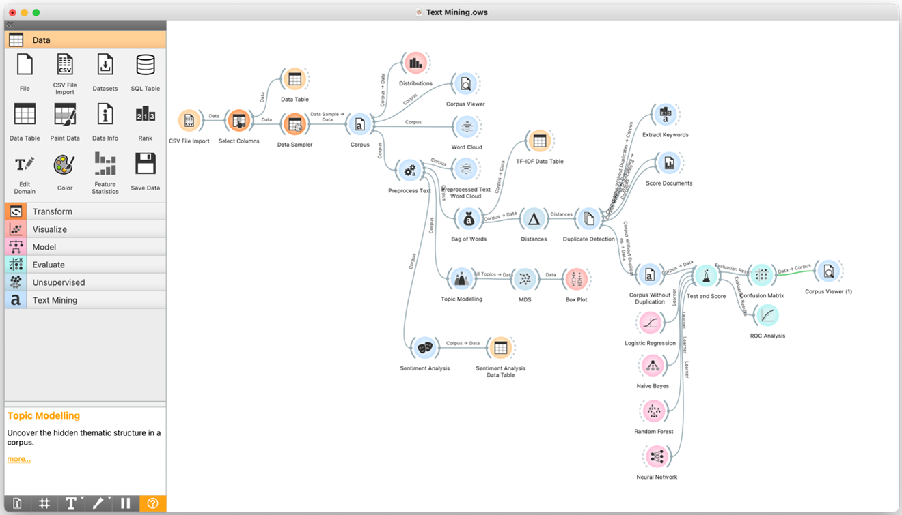

# Text Mining Project

# Business Reason

Mental health issues, including depression and suicidal thoughts, are increasingly prevalent. In the U.S., significant percentages of adults experience mental health conditions, with many unable to access necessary treatment. To address this, creating a classification model for detecting toxic language can help identify potentially harmful comments and improve mental health interventions.

# Data Source

- Dataset: [Mental Health Corpus](https://www.kaggle.com/datasets/reihanenamdari/mental-health-corpus)
- Source: Kaggle
- Description: This dataset contains comments related to mental health, with labels indicating whether the comments are considered toxic or not. It is useful for analyzing language patterns and sentiments related to mental health issues.

# Data Processing

1. Data Import:

- CSV File Import Widget: Loaded mental_health.csv.
- Column Data Types: Set "text" to text and "label" to categorical.

2. Data Sampling:

- Data Sampler Widget: Reduced dataset from 28,000 to approximately 5,000 samples.

3. Text Mining Preparation:

- Corpus Widget: Created a corpus from the dataset.
- Corpus Viewer Widget: Displayed the corpus content.

4. Text Preprocessing:

- Preprocess Text Widget: Applied text transformations (lowercasing, removing accents, HTML parsing, URL removal, tokenization, stopword removal, and stemming). Generated a new word cloud.

5. Topic Modeling:

- Topic Modeling Widget: Used Latent Semantic Indexing to identify 10 topics, showing both positive and negative word clusters.

6. Dimensionality Reduction and Visualization:

- MDS Widget: Explored word clusters by topics.
- Box Plot Widget: Examined representative words for topics.

7. Sentiment Analysis:

- Sentiment Analysis Widget: Computed sentiment scores for text, where -1 is the most negative and 1 is the most positive.

8. Bag of Words Model:

- Bag of Words Widget: Generated a bag of words with TF-IDF weighting.
- TF-IDF Data Table: Analyzed term frequencies.

9. Data Cleaning:

- Distances Widget: Computed pairwise distances.
- Duplicate Detection Widget: Removed duplicates.
- Extract Keywords Widget: Identified characteristic words.
- Score Documents Widget: Scored documents based on word appearance.

10. Model Training:

- Algorithms Used: Logistic Regression, Naïve Bayes, Random Forest, Neural Network.
- Cross-validation: Applied 10-fold cross-validation in the "Test and Score" widget.
