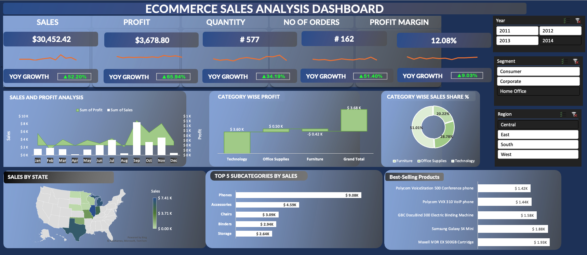

# E-commerce Sales Analysis Dashboard - MS Excel Data Analysis Project

# Project Overview
The E-commerce Sales Analysis Dashboard in MS Excel offers a comprehensive tool for analyzing e-commerce sales metrics and trends. Built to support business owners and analysts alike, this user-friendly dashboard enables a deep dive into key performance indicators (KPIs), empowering data-driven decisions for sales optimization.

# Dataset Information
The dashboard leverages an [E-commerce Sales Dataset](https://github.com/oanhnguyen98/Data-Analytics-and-Visualization-Projects/blob/main/E-commerce%20Sales%20Analysis%20Dashboard%20(MS%20Excel)/Data.xlsx)), encompassing detailed information on sales, orders, product categories, regions, and profit margins. This robust dataset serves as the foundation for calculating various metrics and enables a segmented analysis across different business dimensions.

# Data Analysis
The dashboard includes powerful features to deliver actionable insights:

- Total Calculations: Automatically compute total sales, profit, quantity, orders, and profit margin.
- Dynamic Slicers: Enable easy data segmentation by region, allowing users to filter insights based on specific areas.
- Detailed Category Analysis: Analyze profit by category and identify top-selling products to pinpoint high-performing segments.
- KPI Integration: Track year-on-year growth, visualize trends with sparklines, and use additional visualizations to gain a comprehensive view of sales performance.
