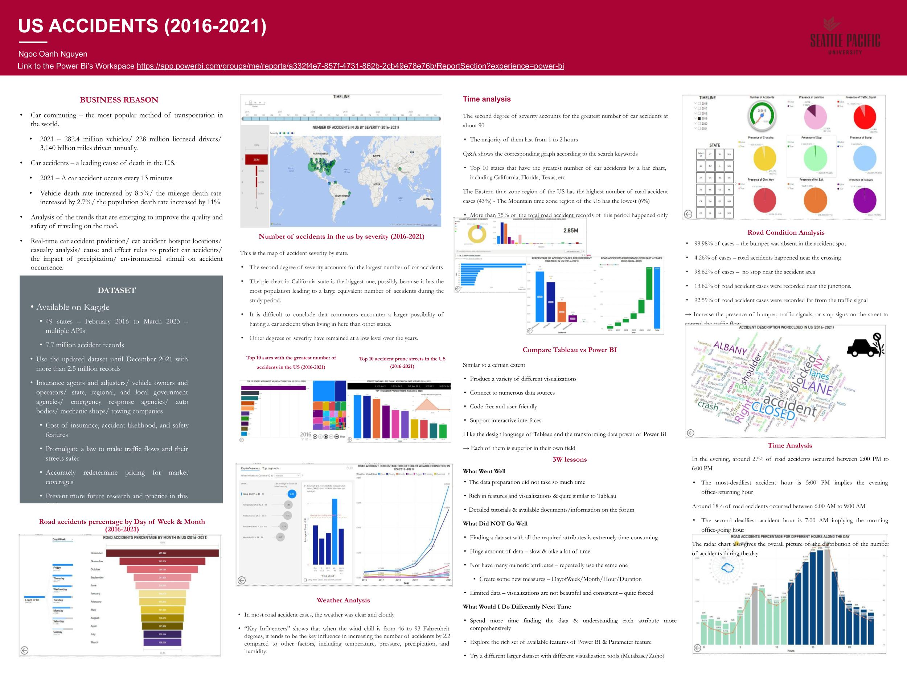

# US Road Accidents Data Analysis Project - Power BI

# Project Overview:

This project aims to analyze car accident data across the United States to understand key trends and factors contributing to road accidents. The dataset used includes over 2.5 million accident records from February 2016 to December 2021, and insights derived from this data can help various stakeholders, such as government agencies, insurance companies, and road safety organizations, make informed decisions to improve road safety. The analysis was conducted using Power BI for visualization and exploration of accident patterns, location impacts, severity, and other contributing factors.

The final visualizations are published on Power BI and can be accessed [here](https://app.powerbi.com/links/9vy1WjbmNo?ctid=d7270324-ea10-47a1-ae5f-74dba073f8fd&pbi_source=linkShare)

# Dataset Information

- Source: Kaggle - [US Accidents Dataset](https://www.kaggle.com/datasets/sobhanmoosavi/us-accidents)
- Period Covered: February 2016 - December 2021
- Data Size: 2.5+ million records
- Collected by: Various US traffic authorities, law enforcement agencies, traffic cameras, and road sensors
- Key Fields: Location, severity, weather conditions, accident duration, time of day, and more.

# Data Processing

1. Data Loading 

- The CSV file US_Accidents_Dec21_updated.csv was loaded using Power BI's Get Data feature.

2. Data Transformation

- Used Power Query Editor to clean and prepare the data
  + Removed redundant text from columns (e.g., split and removed ZIP codes).
  + Aggregated similar weather conditions and accident types using the Replace Values option.
  + Created new calculated columns for accident day, month, hour, and duration using DAX formulas:
    + DayofWeek = FORMAT([Start_Time].[Date], "dddd")
    + Month = FORMAT([Start_Time].[Month], "mmmm")
    + Hour = HOUR([Start_Time])
    + Duration = ABS(DATEDIFF([Start_Time], [End_Time], HOUR))

3. Visualization Setup:

- New Pages: Created multiple report pages to break down various aspects of the data.
- Data Pane: Selected the appropriate measures and fields to visualize.
- Visualizations Pane: Chose the relevant chart types (e.g., bar, map, line, pie) for specific insights.
- Filters and Slicers: Applied filters for accident states and time periods, and added slicers for user interaction.
- Custom Visualizations: Added custom visuals like Radar Chart, Animated Bar Chart Race, Dial Gauge, and WordCloud from Power BI's custom visual marketplace.

# Key Visualizations

1. Accidents by Location and Severity

- Map with Pie Charts shows accident severity by state. California has the largest number of accidents, with the majority classified as medium-impact accidents.

2. Top 10 States for Accidents:

- Animated Bar Chart Race displays the top 10 states with the highest number of accidents over time, revealing a notable increase in California, Texas, and Florida.

3. Road Condition Analysis:

- Pie Charts and Dial Gauge reveal conditions contributing to accidents (e.g., lack of traffic signals, absence of speed bumps).

4. Time and Day Analysis:

- Line and Radar Charts show accident trends by time of day. The most accidents happen around 7:00 AM and 5:00 PM, corresponding to rush hours.

5. Accident Causes:

- Word Cloud highlights key causes like "road blocked" and "accident on right side," though some unrelated words require further cleaning.

6. Accidents by Weather Conditions:

- Key Influencers analysis indicates that when wind chill is between 46 and 93°F, accident likelihood increases.

# Tool Utilization in Power BI

- Data Cleaning: Used Power Query Editor to refine raw data and ensure consistency.
- DAX Formulas: Created calculated columns for analyzing time-based trends (e.g., Day of Week, Month, Hour).
- Visual Types:
  + Maps: Show spatial distribution of accidents.
  + Bar/Column Charts: Track accidents over time and by state.
  + Pie/Donut Charts: Visualize severity and conditions at the time of accidents.
  + Line Charts: Trend analysis of accidents by time.
  + Radar Charts: Show overall patterns for different time periods.
  + Word Cloud: Display frequently occurring words in accident descriptions.
- Interactivity: Enabled filters and slicers to allow users to explore data by specific states, time periods, and conditions.
- Custom Visuals: Added animations (e.g., Animated Bar Chart Race) to show dynamic changes over time.

# Key Insights

- High-Risk States: California, Texas, and Florida are hotspots for car accidents.
- Accident Severity: Most accidents cause medium-level disruption to traffic.
- Time of Day: Accidents peak during morning and evening rush hours.
- Weather Impact: Clear weather is most common, but certain temperature ranges increase accident likelihood.
- Road Safety Conditions: Absence of stop signs, traffic signals, and speed bumps are key contributors to accidents.

# Conclusion

The analysis provides a comprehensive overview of road accidents in the US, helping to identify key factors that lead to accidents and possible preventive measures. The Power BI dashboard offers a versatile, interactive way to explore the dataset, allowing stakeholders to make data-driven decisions to improve road safety.
